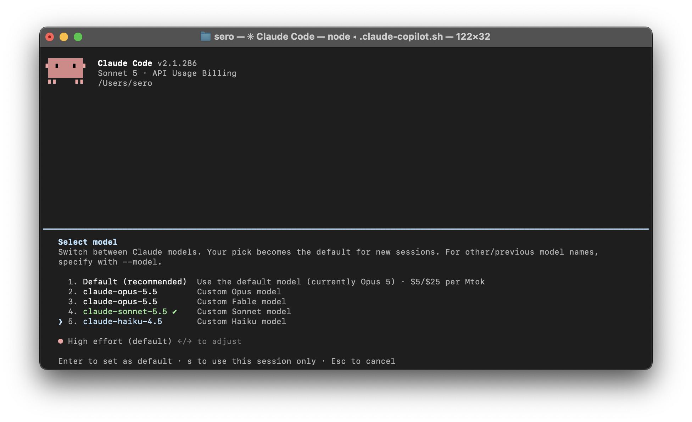

# claude-copilot



Run Claude Code on GitHub Copilot models. No Anthropic account needed, just a Copilot plan.

One self-contained file: `claude-copilot.sh`. Works in bash 3.2+ (incl. macOS `/bin/bash`) and zsh. Not POSIX sh.

## Requirements

`python3` (3.6+), `curl`, `claude` (Claude Code). Run it from an interactive terminal (the first-run login needs one). No node, no npm packages. The script checks these on startup and tells you what's missing.

The published release artifact is a single self-contained `claude-copilot.sh`. The repository source is split into testable files under `src/`; `dist/` is generated locally and is not committed.

First run asks for a GitHub device-code login (open the URL, type the code). The login is kept in `~/.local/share/claude-copilot/github_token` (mode 600).

## Install

```sh
curl -fsSL https://raw.githubusercontent.com/seropian/claude-copilot/main/install.sh | bash
```

The installer always installs the latest GitHub Release to `~/.local/bin/claude-copilot` (override with `INSTALL_DIR`). Rerun to update. Development branch installs are not supported because the generated artifact is intentionally not committed; build locally with `make build` instead. Want to read it first? Download `install.sh` and run it yourself.

Release assets are available at:

```text
https://github.com/seropian/claude-copilot/releases/latest/download/claude-copilot.sh
https://github.com/seropian/claude-copilot/releases/download/v0.1.0/claude-copilot.sh
```

Verify a downloaded asset with the checksum from the same release:

```sh
curl -fsSLO https://github.com/seropian/claude-copilot/releases/latest/download/claude-copilot.sh
curl -fsSLO https://github.com/seropian/claude-copilot/releases/latest/download/claude-copilot.sh.sha256
shasum -a 256 -c claude-copilot.sh.sha256
```

## Uninstall

```sh
curl -fsSL https://raw.githubusercontent.com/seropian/claude-copilot/main/uninstall.sh | bash
```

Removes `~/.local/bin/claude-copilot` (or `INSTALL_DIR`), the saved login in `~/.local/share/claude-copilot`, and the log. Set `KEEP_LOGIN=1` to keep the token. Or by hand: `rm ~/.local/bin/claude-copilot; rm -rf ~/.local/share/claude-copilot`. Also remove the `PATH` line from your shell profile if you added it.

## Building and releasing

Source lives under `src/claude_copilot_shim/` as a normal Python package; `dist/claude-copilot.sh` is generated and should not be edited by hand. The build bundles the package into the self-contained launcher, so runtime behavior does not depend on source filename order. The `dist/` directory is local build output and is not committed. Build and test it with:

```sh
make build
make test
make check
```

Create and publish a versioned release by pushing a tag through the release target:

```sh
make release VERSION=1.0.0
```

This updates `VERSION`, builds the ignored `dist/claude-copilot.sh`, runs tests, commits the source and version only, creates `v1.0.0`, and pushes the commit and tag. GitHub Actions then builds the artifact again, verifies it, and publishes `claude-copilot.sh` plus its SHA-256 checksum as a GitHub Release. Real network tests remain opt-in with `E2E=1 make test`.

The release workflow is the only publishing step. It never commits `dist/`; rerunning a tag workflow re-uploads the same deterministic assets.

## Usage

```sh
claude-copilot                 # interactive
claude-copilot -p "prompt"     # one-shot
claude-copilot -c              # resume last session
COPILOT_CLAUDE_MODEL=claude-opus-5.5 claude-copilot
```

All args go straight to `claude`. Exit code is passed through.

## How it works

```
claude -> shim (python, 127.0.0.1:<free port>) -> GitHub Copilot API
```

One small Python server (bundled into the script) sits between Claude Code and Copilot. Source modules use normal imports; the release launcher carries a deterministic, readable minified Python bundle, so there is no other gateway process.

- Claude Code is pointed at the shim via `ANTHROPIC_BASE_URL` + `ANTHROPIC_AUTH_TOKEN` (a random key kept in the shim state file; the shim rejects requests without it, and any `Host` header that isn't localhost, so other local processes and web pages can't spend your Copilot quota). The launcher passes the same values in Claude Code's session settings so background agents can use the local shim too; the inline environment is kept for older clients. Your shell stays clean. The shim only listens on `127.0.0.1`.
- **Auth:** GitHub device-code login with the VS Code Copilot client id, then the shim trades the GitHub token for a short-lived Copilot token (`/copilot_internal/v2/token`) and refreshes it before it expires. The API host comes from that token response, so business/enterprise accounts work too.
- **Routing:** per model, the shim reads `supported_endpoints` from Copilot's `/models` (cached 5 min) and picks:
    - `/v1/messages` (Claude models): forwarded as is, Anthropic format.
    - `/responses` (GPT-5.x/6.x, Grok, MAI): translated from `/v1/messages` (text, tools, images, streaming).
    - `/chat/completions` (Gemini, Kimi, others): translated the same way.
- **Request rewrites** (on the native `/v1/messages` route, so Copilot doesn't 400 on what Claude Code sends):
    - System-role messages in `messages` are turned into user messages and adjacent user turns are merged (`tool_result` blocks first). Copilot's Claude 5.x models treat a trailing system message as assistant prefill and reject it.
    - Fields Copilot rejects ("Extra inputs are not permitted", e.g. `safeguards`) are dropped on the 400, top-level or nested (like `cache_control.scope`), then the request is retried (up to 5 times) and logged. A path it can't find is passed through as the 400.
    - `thinking` is rewritten (or dropped) on the 400 and retried, and the fix is remembered per model for the rest of the run. Models accept different settings, and auto mode's classifier always asks for `disabled`, so it'd fail without this. Known quirks:
        - claude-sonnet-5.5 rejects `disabled` (wants `between_tools`).
        - claude-opus-5.5 rejects `disabled`.
        - Most reject `enabled` with a budget (want `adaptive`).
        - A rejected `adaptive` (claude-haiku-4.5) is passed through untouched, Claude Code retries without thinking by itself.
    - `/v1/messages/count_tokens` is forwarded to Copilot for models on its native endpoint, which returns a real count. Other models, or any failure, get a rough estimate (request size in bytes / 4).
- Model aliases (sonnet/opus/haiku/fable) are mapped to Copilot model IDs, since Anthropic's IDs don't exist on Copilot.
- At startup the script asks the shim for the model list (chat models Copilot marks `model_picker_enabled`, so no embeddings, internal models, or the old gpt-3*/gpt-4* families) and passes it to `claude --settings` as a `modelPicker` list, so `/model` shows all of them. Claude Code's own gateway discovery isn't used: it drops any id without `claude` in it.

Lifecycle:

1. Log in if there's no stored token.
2. Start a background GitHub Releases check for a newer launcher. Network, parsing, checksum, and download errors are ignored and never delay startup.
3. Start the shim. Bails if its port is taken.
4. Run `claude`.
5. The shim is left running on purpose, so backgrounded or resumed sessions don't hit "connection refused". Later runs reuse it; if it died, they restart it on the same port with the same key so old sessions reconnect. On a normal exit, a helper waits for the launcher to stop and atomically replaces it with the verified download. HUP/TERM/INT during startup clean up the half-started shim.

Run as many instances in parallel as you like, they share one shim (state in `~/.local/share/claude-copilot/shim.state`, override with `COPILOT_STATE_DIR`). Stop it with `claude-copilot --stop-shim`.

## Config

All env vars, all optional.

| Var | Default | What |
|---|---|---|
| `COPILOT_CLAUDE_MODEL` | `claude-sonnet-5.5` | main model |
| `COPILOT_SONNET_MODEL` | `claude-sonnet-5.5` | `sonnet` alias target |
| `COPILOT_OPUS_MODEL` | `claude-opus-5.5` | `opus` alias target |
| `COPILOT_FABLE_MODEL` | `claude-opus-5.5` | `fable` alias target. Copilot has no Fable model, so picking it really gives you whatever this points to |
| `COPILOT_HAIKU_MODEL` | `claude-haiku-4.5` | `haiku` alias target |
| `COPILOT_SHIM_PORT` | unset (free port) | pin the shim to a fixed port (starts a separate shim if the running one uses another port) |
| `COPILOT_TOKEN_FILE` | `~/.local/share/claude-copilot/github_token` | where the GitHub token is stored |

Installer vars (only read by `install.sh` / `uninstall.sh`):

| Var | Default | What |
|---|---|---|
| `INSTALL_DIR` | `~/.local/bin` | where the script is installed or removed from |
| `CLAUDE_COPILOT_VERSION` | unset (latest release) | release version to install, e.g. `0.1.0` |
| `KEEP_LOGIN` | unset | set to `1` to keep the saved token on uninstall |

Files:

- `$TMPDIR/claude-copilot.log`: shim log (errors, dropped fields, upstream status codes)
- `~/.local/share/claude-copilot/github_token`: your GitHub token. Delete it to log in again.

## Tested models

**Last checked 2026-10-02 with Claude Code 2.1.286, results may be stale.** Each model got a plain "reply ok" check and a Bash tool-call check, streaming, through the shim. Images were checked on one model per route (claude-sonnet-5.5, gpt-5.5, gemini-3.7-flash).

- **Work (all 24 in the picker):** claude-opus-4.7, claude-opus-4.8, claude-opus-5.5, claude-opus-5, claude-sonnet-5.5, claude-sonnet-5, claude-haiku-4.5, gemini-3.7-flash, gemini-3.8-flash, gpt-5.3-codex, gpt-5.4-mini, gpt-5.4, gpt-5.5, gpt-5.6-luna/-sol/-terra, gpt-5-mini, gpt-6-luna/-sol, gpt-6.1-sol, grok-4.7, kimi-k2.7-code, kimi-k3, mai-code-1.1-flash
- **Hidden from the picker** (Copilot doesn't mark them for the model picker, you can still pass them with `COPILOT_CLAUDE_MODEL`, they go through `/chat/completions`):
    - gpt-4, gpt-4-0613, gpt-4-0125-preview: work (checked 2026-10-02)
    - gpt-4o*, gpt-4.1*, gpt-3.5-turbo*, gpt-4-o-preview: untested. Every call got 429 "exceeded your rate limit for utility models" (account-level limit after a burst of test requests)
    - gpt-41-copilot: 400 model_not_supported

Not tested: `auto`. The model list depends on your Copilot plan.

## Known issues / limits

- **Unofficial:** this uses GitHub's private Copilot endpoints, with the VS Code Copilot client id and headers. It may break when GitHub changes things, and may be against GitHub's terms. Your call.
- **Billing:** premium requests count against your Copilot plan.
- **Rate limits:** Copilot rate-limits per account and model tier (the small "utility" models like gpt-4o-mini hit it first). On a 429 Claude Code retries until it gives up, so it looks like a hang. Look for `429` in `$TMPDIR/claude-copilot.log`, wait it out.
- **Non-Claude models:** GPT/Gemini/Kimi go through a translation layer, tool calling can be less reliable than Claude. Thinking blocks and prompt-cache controls are not translated.
- **`auto` model:** Copilot's auto-routing is done client-side by Copilot's own apps, the API doesn't expose it. Use Copilot CLI for that.
- **Catalog warning:** Claude Code warns the model isn't in its catalog and assumes a 200k context. The script sets `CLAUDE_CODE_DISABLE_UNKNOWN_MODEL_WINDOW_ENFORCEMENT=1` to relax that.
- **Auto mode:** works, but the safety checks run as Claude Code's own requests through Copilot (they count against your plan), not on Anthropic's server. The script sets `CLAUDE_CODE_AUTO_MODE_SERVER=0` because Copilot rejects the `safeguards` field the server-side checks need, and this also stops the "session isn't eligible" notice. The classifier's `thinking: disabled` is handled by the shim, see "Request rewrites".
- **`claude --bare`** also avoids the system-message problem, but drops hooks and CLAUDE.md. The shim is the better fix.

## Troubleshooting

- **Port busy:** you set `COPILOT_SHIM_PORT` and something other than the shim holds it. Unset it to get a free port.
- **Stopping the shim:** `claude-copilot --stop-shim`. The next run starts a fresh one.
- **"GitHub refused the Copilot token request":** the stored login is bad or the account has no Copilot access. Delete `~/.local/share/claude-copilot/github_token` and rerun.
- **Background agent says it is not logged in:** run `claude-copilot` once from an interactive terminal so the GitHub device login is stored. The launcher reuses that stored login and puts the shim URL/key in the session settings for background agents; it does not ask you to log in again.
- **Shim didn't start:** check `$TMPDIR/claude-copilot.log`.
- **400 `model_not_supported`:** the model ID doesn't exist on Copilot. `/model` only lists the ones that do.
- **400 "prefill" on a Claude 5.x model:** the request shape changed. Look at the log.
- **400 "Extra inputs are not permitted" showing up for the client:** the shim couldn't find the field Copilot named, or hit the 5-retry cap. Look at the log for the field name.

## How the JetBrains Copilot plugin does the same

Observed locally, plugin is closed source. Short version: the IDE's `copilot-language-server` spawns `claude` and runs its own Anthropic-compatible local endpoint (`127.0.0.1:<random port>`) that forwards to Copilot. The bearer token is per session and unreadable from outside, so a standalone `claude` can't reuse it. That's why this script runs its own shim.

## Credits

Made by [Dikran Seropian](https://github.com/seropian). The script embeds its own device login flow and Anthropic-to-Copilot translation shim.

## License

[Apache 2.0](LICENSE)
